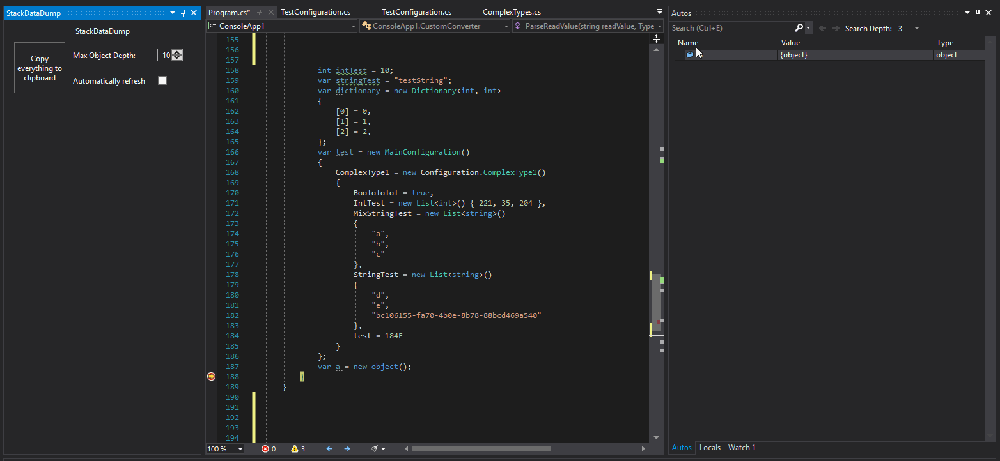

# DumpStackToCSharpCode
DumpStackToCSharpCode provides functionality to dump stack to C# code directly from visual studio while debugging application.
You can do it from context menu, which is invoked from Autos or Locals windows.

## Demo 1 
Invoking action from Autos window.

## Demo 2
Invoking action from Locals window.

## Demo 3
Refresh automatically during debugging.

## Configuration
Basic configuration.
